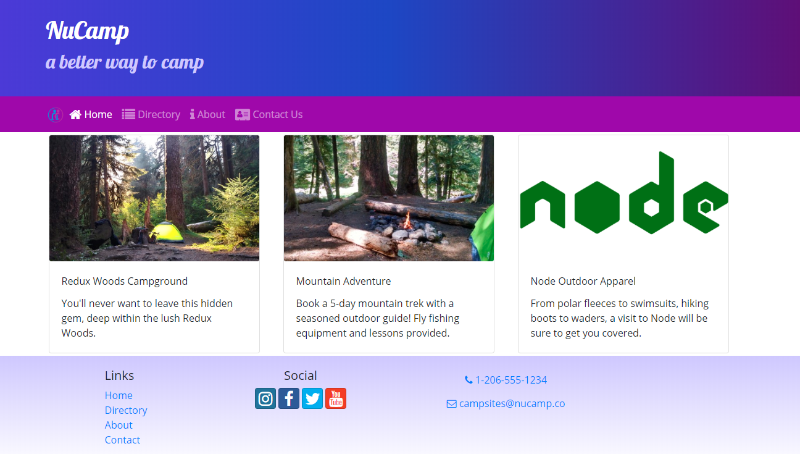

Alex Griffin

Software that was used:
*HTML
*JavaScript
*CSS
*React
*React-Bootstrap

A Campsite Build

---
A site that allows users to choose a campsite and decide on how 
they would like to camp. Also gives you updated facts about Nucamp
campsites
---

